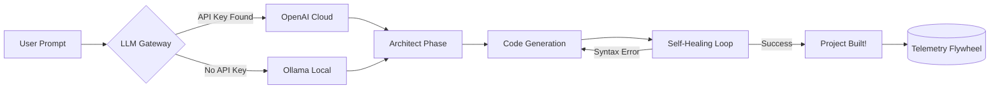

<div align="center">

# 🛡️ VibeGuard
**The Autonomous Software Factory powered by Local AI.**

[](https://www.python.org/downloads/release/python-3100/)
[](https://opensource.org/licenses/MIT)
[](https://ollama.com/)
[](https://openai.com/)

*Type a prompt. Watch the code build itself.*

</div>

---

## 🚀 What is VibeGuard?

VibeGuard is an **autonomous AI coding agent** that acts like a Senior Staff Engineer on your computer. 
Instead of chatting with AI in a browser and copying/pasting code manually, you give VibeGuard a single prompt. It will architect the project, choose the tech stack, generate all the files, and use built-in **self-healing loops** to fix its own bugs.

### The Dual-Engine Brain
VibeGuard is designed to be accessible to everyone. It features a Dual-Engine LLM router:
- **🆓 Free Local Engine:** Automatically detects and connects to [Ollama](https://ollama.com/) to write code using local, open-source models completely offline for $0.
- **☁️ Premium Cloud Engine:** Paste your OpenAI key into `.env` to unleash GPT-4o for complex, enterprise-grade architecture.

---

## ⚡ How It Works



---

## 📦 Quick Start (Using the Executable)

You do not need Python or any coding experience to run VibeGuard.

1. **Download** the `VibeGuard.exe` file from the [Releases](#) tab.
2. **Open your Terminal** (Command Prompt or PowerShell).
3. **Run the agent:**
```bash
.\VibeGuard.exe build "Create a beautiful real estate landing page using React"
```

*Note: If you want to use the Free Local Engine, ensure you have downloaded [Ollama](https://ollama.com/) and run `ollama run llama3` in the background first!*

---

## 🛠️ For Developers (Source Code)

If you want to build from source, modify the agent, or compile your own `.exe`:

```bash
# 1. Clone and install
git clone https://github.com/yourusername/vibeguard.git
cd vibeguard
pip install -r requirements.txt

# 2. Run the agent natively
python vibeguard.py build "Build a snake game in Python"

# 3. Compile the standalone .exe for distribution
python compile_app.py
```

---

## ✨ Features

| Feature | Description |
|---------|-------------|
| 🤖 **Autonomous Coding** | Creates folders, files, and writes code from a single text prompt. |
| 🛡️ **Self-Healing Loop** | If it writes buggy code, it detects the error and rewrites it automatically. |
| 🧠 **Project Memory** | Prevents "Context Collapse" by scanning and remembering massive codebases. |
| 🗜️ **Token Compression** | Squeezes out whitespace and comments to save you 40% on API costs. |
| 📈 **Data Flywheel** | Built-in telemetry securely syncs successful build data to a central database. |

---

## 🔮 The Vision

VibeGuard was originally built to be a safety-net CLI tool for Cursor users. It has now evolved into an end-to-end Autonomous Software Factory capable of building real-world applications. By collecting telemetry and feeding errors back into its self-healing loop, VibeGuard is designed to get smarter every single time someone uses it.

---
<div align="center">
<i>Built to make AI coding autonomous, safe, and free.</i>
</div>
