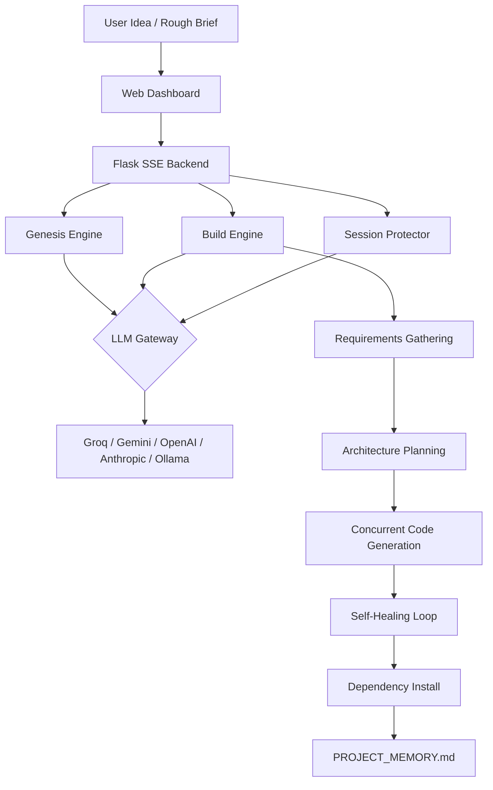

<div align="center">

# 🛡️ VibeGuard
### The AI-Native Developer Platform

[](https://www.python.org/downloads/)
[](https://opensource.org/licenses/MIT)
[](https://console.groq.com)
[](https://aistudio.google.com)
[](https://openai.com)
[](https://anthropic.com)
[](https://ollama.com)

**Build. Guard. Debug. Fix. Ship.**

*The end-to-end autonomous software factory with a beautiful Web Dashboard.*

</div>

---

## 🚀 The Web Dashboard Experience

VibeGuard is no longer just a command-line tool. It now features a **professional Web UI** that launches automatically. 

- **For Clients:** Double-click `VibeGuard.exe` and a sleek dashboard opens in your browser.
- **For Developers:** Complete control via the dashboard or the powerful CLI.
- **Real-time Streaming:** Watch the agent architect and code your project in real-time.

---

## 🎯 Who Is This For?

| You are... | VibeGuard helps you... |
|------------|----------------------|
| 🎨 **A vibe coder** using Cursor/ChatGPT | Stop losing code when AI rewrites your files |
| 🏢 **A freelancer/intern** with a client idea | Turn vague requirements into a full blueprint in minutes |
| 🐛 **A developer** stuck on a bug | Get the root cause + exact fix, not generic advice |
| 🚀 **A team lead** starting a new product | Generate PRD, architecture, database schema, API spec — from scratch |

---

## 🔥 The Real Problems We Solve

### Problem 1: "AI deleted my code and I didn't notice until everything broke"
→ **Session Protector** snapshots every function, class, and API route before your AI session. After the session, it shows you exactly what was removed and gives you a restore prompt.

### Problem 2: "I have a rough idea from a client but no docs, no Figma, no architecture"
→ **Project Genesis** interviews you with 6 smart questions, then generates 7 professional documents: PRD, Architecture, Database Schema, API Spec, Dev Plan, AI Prompts, and `.cursorrules`.

### Problem 3: "I can't explain my error to the AI properly so it never fixes it"
→ **Error Detective** reads your full codebase + error, finds the exact root cause, and generates a precise prompt you can paste into any AI tool.

### Problem 4: "I don't know how to prompt the AI to build what I actually want"
→ **Genesis** generates ready-to-paste prompts specifically for your project — not generic, but tailored with your tech stack, features, and constraints.

### Problem 5: "Every AI has a different API key setup — I don't know how to use it"
→ **One-time wizard** walks anyone through setup in 60 seconds. Groq is **100% free** with no credit card required.

---

## ⚡ Quick Start

```bash
# Clone
git clone https://github.com/20omkale/vibeguard.git
cd vibeguard

# Install dependencies
pip install -r requirements.txt

# Launch the Dashboard
python vibeguard.py
```

> **No credit card needed.** Groq's free tier gives you 14,400 requests/day with llama3-70b.  
> Get your free key at [console.groq.com](https://console.groq.com) in 30 seconds.

---

## 🧠 AI Providers — Pick One, Set It Once

VibeGuard supports 5 providers. The Dashboard guides you through setup:

| Provider | Cost | Model | Get Key |
|----------|------|-------|---------|
| **Groq** ⭐ Recommended | **FREE** (14,400 req/day) | llama3-70b | [console.groq.com](https://console.groq.com) |
| **Google Gemini** | **FREE** (generous quota) | gemini-1.5-flash | [aistudio.google.com](https://aistudio.google.com) |
| **OpenAI** | Paid | gpt-4o | [platform.openai.com](https://platform.openai.com) |
| **Anthropic** | Paid | claude-3-5-sonnet | [console.anthropic.com](https://console.anthropic.com) |
| **Ollama** | Free, offline | llama3 | [ollama.com](https://ollama.com) |

---

## 🚀 Dashboard Modules

### 💡 Project Genesis
Rough idea → 7 professional documents in one shot:
- `PRD.md` — Features, user stories, success KPIs
- `ARCHITECTURE.md` — Tech stack decisions + Mermaid diagrams  
- `DATABASE_SCHEMA.md` — Full schema with indexes and relationships
- `API_SPEC.md` — Every endpoint with request/response examples
- `DEV_PLAN.md` — Sprint-by-sprint development plan
- `AI_PROMPTS.md` — Perfect ready-to-paste prompts for Cursor/Claude/ChatGPT
- `.cursorrules` — AI behavior rules specific to YOUR project

### 🏗️ Autonomous Build
5-phase pipeline:
1. **Requirements** — Asks 3-5 clarifying questions
2. **Architecture** — Plans all files, shows you the plan, asks confirmation
3. **Code** — Generates all files concurrently with self-healing syntax checks
4. **Install** — Runs `npm install` / `pip install` automatically
5. **Guard** — Checks for regressions and generates `PROJECT_MEMORY.md`

### 🛡️ Session Protector
The #1 vibe coding feature. Snapshots your code before an AI session, compares after.
- Detects deleted functions, routes, and exports.
- Generates a **restore prompt** to recover lost code instantly.

---

## 🏗️ Architecture



---

## 🆚 How We Compare

| Feature | ChatGPT / Claude | Cursor | GitHub Copilot | **VibeGuard** |
|---------|-----------------|--------|----------------|---------------|
| **Visual Dashboard UI** | ❌ | ❌ | ❌ | ✅ |
| Generates PRD from rough idea | ❌ | ❌ | ❌ | ✅ |
| Detects AI-deleted code | ❌ | ❌ | ❌ | ✅ |
| Builds entire project end-to-end | ❌ | ❌ | ❌ | ✅ |
| Works 100% free (no credit card) | ❌ | ❌ | ❌ | ✅ |
| Self-improves from past builds | ❌ | ❌ | ❌ | ✅ |

---

<div align="center">

*Built to solve the real problems developers actually face every day.*

**[⭐ Star this repo](https://github.com/20omkale/vibeguard)** if VibeGuard saved you from losing code.

</div>
