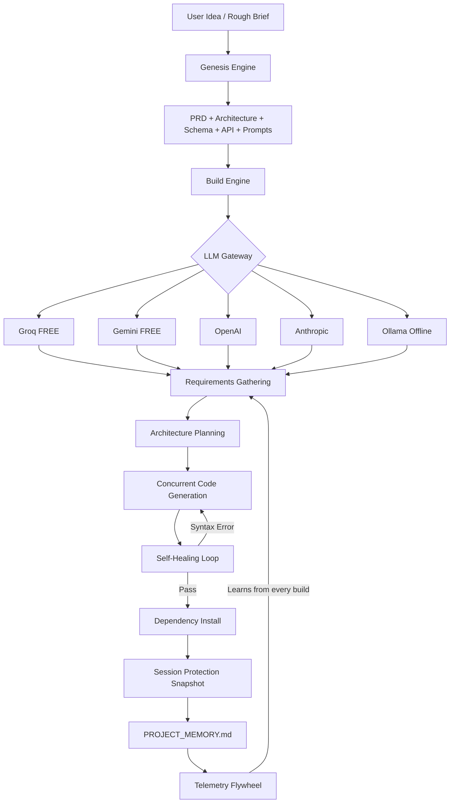

<div align="center">

# 🛡️ VibeGuard
### The AI-Native Developer Platform

[](https://www.python.org/downloads/)
[](https://opensource.org/licenses/MIT)
[](https://console.groq.com)
[](https://aistudio.google.com)
[](https://openai.com)
[](https://anthropic.com)
[](https://ollama.com)

**Build. Guard. Debug. Fix. Ship.**

*From a rough idea to production-ready code — without losing a single line of work.*

</div>

---

## 🎯 Who Is This For?

| You are... | VibeGuard helps you... |
|------------|----------------------|
| 🎨 **A vibe coder** using Cursor/ChatGPT | Stop losing code when AI rewrites your files |
| 🏢 **A freelancer/intern** with a client idea | Turn vague requirements into a full blueprint in minutes |
| 🐛 **A developer** stuck on a bug | Get the root cause + exact fix, not generic advice |
| 🚀 **A team lead** starting a new product | Generate PRD, architecture, database schema, API spec — from scratch |

---

## 🔥 The Real Problems We Solve

### Problem 1: "AI deleted my code and I didn't notice until everything broke"
→ **Session Protector** snapshots every function, class, and API route before your AI session. After the session, it shows you exactly what was removed and gives you a restore prompt.

### Problem 2: "I have a rough idea from a client but no docs, no Figma, no architecture"
→ **Project Genesis** interviews you with 6 smart questions, then generates 7 professional documents: PRD, Architecture, Database Schema, API Spec, Dev Plan, AI Prompts, and `.cursorrules`.

### Problem 3: "I can't explain my error to the AI properly so it never fixes it"
→ **Error Detective** reads your full codebase + error, finds the exact root cause, and generates a precise prompt you can paste into any AI tool.

### Problem 4: "I don't know how to prompt the AI to build what I actually want"
→ **Genesis** generates ready-to-paste prompts specifically for your project — not generic, but tailored with your tech stack, features, and constraints.

### Problem 5: "Every AI has a different API key setup — I don't know how to use it"
→ **One-time wizard** walks anyone through setup in 60 seconds. Groq is **100% free** with no credit card required.

---

## ⚡ Quick Start

```bash
# Clone
git clone https://github.com/20omkale/vibeguard.git
cd vibeguard

# Install dependencies
pip install -r requirements.txt

# First-time setup (60 seconds, Groq is free)
python vibeguard.py config

# Or just run — the wizard appears automatically
python vibeguard.py
```

> **No credit card needed.** Groq's free tier gives you 14,400 requests/day with llama3-70b.  
> Get your free key at [console.groq.com](https://console.groq.com) in 30 seconds.

---

## 🧠 AI Providers — Pick One, Set It Once

VibeGuard supports 5 providers. The config wizard guides you through setup:

| Provider | Cost | Model | Get Key |
|----------|------|-------|---------|
| **Groq** ⭐ Recommended | **FREE** (14,400 req/day) | llama3-70b | [console.groq.com](https://console.groq.com) |
| **Google Gemini** | **FREE** (generous quota) | gemini-1.5-flash | [aistudio.google.com](https://aistudio.google.com) |
| **OpenAI** | Paid | gpt-4o | [platform.openai.com](https://platform.openai.com) |
| **Anthropic** | Paid | claude-3-5-sonnet | [console.anthropic.com](https://console.anthropic.com) |
| **Ollama** | Free, offline | llama3 | [ollama.com](https://ollama.com) |

Config is saved globally in `~/.vibeguard/config.json` — set once, works everywhere.

---

## 🚀 Commands

### `vibeguard genesis` — Blueprint from a Rough Idea
```bash
python vibeguard.py genesis "a food delivery app like Swiggy"
python vibeguard.py genesis "a SaaS tool for invoice management"
python vibeguard.py genesis  # interactive mode
```
Generates 7 documents in one shot:
- `PRD.md` — Features, user stories, success KPIs
- `ARCHITECTURE.md` — Tech stack decisions + Mermaid diagrams  
- `DATABASE_SCHEMA.md` — Full schema with indexes and relationships
- `API_SPEC.md` — Every endpoint with request/response examples
- `DEV_PLAN.md` — Sprint-by-sprint development plan
- `AI_PROMPTS.md` — Perfect ready-to-paste prompts for Cursor/Claude/ChatGPT
- `.cursorrules` — AI behavior rules specific to YOUR project

---

### `vibeguard build` — Autonomous Code Generation
```bash
python vibeguard.py build "a todo app with React and FastAPI"
python vibeguard.py build "a Discord bot that tracks stock prices"
python vibeguard.py build  # interactive mode
```
5-phase pipeline:
1. **Requirements** — Asks 3-5 clarifying questions
2. **Architecture** — Plans all files, shows you the plan, asks confirmation
3. **Code** — Generates all files concurrently with self-healing syntax checks
4. **Install** — Runs `npm install` / `pip install` automatically
5. **Guard** — Checks for regressions and generates `PROJECT_MEMORY.md`

---

### `vibeguard protect` — Session Protection (The #1 Vibe Coder Feature)
```bash
# Step 1: BEFORE your AI coding session
python vibeguard.py protect --before

# ... use Cursor, ChatGPT, Claude as usual ...

# Step 2: AFTER your AI session
python vibeguard.py protect --after

# Or: continuous real-time monitoring
python vibeguard.py protect --watch
```

Tracks every function, class, API route, and export. If anything was deleted, shows you:
- Exactly which functions disappeared (with original line numbers)
- Which API routes were removed
- Which exports vanished
- **Severity level**: CLEAN / LOW / MEDIUM / HIGH
- A ready-to-paste **restore prompt** to recover deleted code

---

### `vibeguard diagnose` — Error Detective
```bash
python vibeguard.py diagnose -e "TypeError: Cannot read properties of undefined"
python vibeguard.py diagnose -f error.log
python vibeguard.py diagnose  # paste error interactively
```
Reads your full codebase + error → returns root cause + exact fix + AI prompt.

---

### Other Commands
```bash
python vibeguard.py init      # Initialize VibeGuard in an existing project
python vibeguard.py scan      # Generate/update PROJECT_MEMORY.md
python vibeguard.py guard     # Watch for regressions between commits
python vibeguard.py compress  # Compress codebase (saves ~40-70% tokens)
python vibeguard.py score     # Health score (1-10,000 scale)
python vibeguard.py status    # Quick status of all VibeGuard systems
python vibeguard.py config    # Change AI provider or update API keys
```

---

## 🏗️ Architecture



---

## 🧬 Self-Improving Flywheel

Every build teaches VibeGuard to build better:

1. Build starts → reads past learnings from `~/.vibeguard/global_learnings.json`
2. Agent incorporates lessons into its system prompt
3. Build completes → outcome (success/failure + error logs) saved back
4. Next build for similar projects uses this knowledge

The more you use it, the smarter it gets for your specific stack.

---

## 📁 Project Structure

```
vibeguard/
├── vibeguard.py              # CLI entry point (11 commands)
├── requirements.txt
├── compile_app.py            # Build standalone .exe
│
└── core/
    ├── config_manager.py     # First-run wizard, API key storage
    ├── llm_gateway.py        # Universal 5-provider LLM router
    ├── project_genesis.py    # Blueprint from rough idea (Genesis Engine)
    ├── autonomous_agent.py   # 5-phase build pipeline
    ├── session_protector.py  # AI code deletion protection
    ├── error_detective.py    # Root cause analysis
    ├── initializer.py        # Stack detection + .cursorrules generator
    ├── memory_engine.py      # PROJECT_MEMORY.md generation
    ├── change_guardian.py    # Regression detection
    ├── context_compressor.py # Token compression
    ├── regression_tracker.py # 1-10,000 health scoring
    └── telemetry.py          # Build outcome logging
```

---

## 🆚 How We Compare

| Feature | ChatGPT / Claude | Cursor | GitHub Copilot | **VibeGuard** |
|---------|-----------------|--------|----------------|---------------|
| Generates PRD from rough idea | ❌ | ❌ | ❌ | ✅ |
| Detects AI-deleted code | ❌ | ❌ | ❌ | ✅ |
| Tracks every function/route | ❌ | ❌ | ❌ | ✅ |
| Builds entire project end-to-end | ❌ | ❌ | ❌ | ✅ |
| Explains errors with codebase context | Partially | Partially | ❌ | ✅ |
| Works 100% free (no credit card) | ❌ | ❌ | ❌ | ✅ |
| Self-improves from past builds | ❌ | ❌ | ❌ | ✅ |
| Generates perfect AI prompts | ❌ | ❌ | ❌ | ✅ |
| Standalone .exe (no Python needed) | ❌ | ❌ | ❌ | ✅ |

---

## 🏢 Subscription Tiers (Coming Soon)

| | **Free** | **Pro** ($9/mo) | **Team** ($29/mo) |
|-|----------|----------------|------------------|
| Genesis blueprints | 3/month | Unlimited | Unlimited |
| Build projects | 5/month | Unlimited | Unlimited |
| Session protection | ✅ | ✅ | ✅ |
| Error diagnosis | 10/month | Unlimited | Unlimited |
| Global learnings (shared brain) | ❌ | ✅ | ✅ |
| Priority support | ❌ | ❌ | ✅ |

> Free tier is genuinely useful. Pro is cheaper than one hour of a freelancer's time.

---

## 🛠️ Compile to Standalone .exe

Distribute to non-technical clients — no Python installation required:

```bash
python compile_app.py
# Output: dist/VibeGuard.exe
```

Client usage:
```bash
VibeGuard.exe genesis "build me an e-commerce site"
VibeGuard.exe build "a REST API for a food ordering app"
```

---

<div align="center">

*Built to solve the real problems developers actually face every day.*

**[⭐ Star this repo](https://github.com/20omkale/vibeguard)** if VibeGuard saved you from losing code.

</div>
